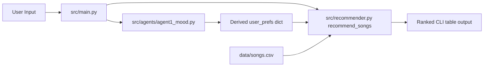
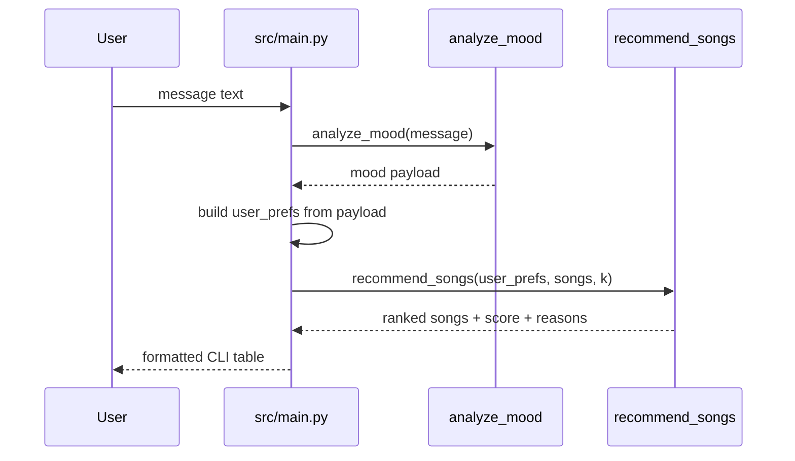

# Implementation Guide

## 1. Purpose And Scope

This guide documents the current codebase behavior for the terminal-first music recommender and Agent 1 mood parsing path. It is intended to let another engineer or coding agent implement, modify, or extend the project in one pass without guessing contracts.

Scope covered:
- CLI execution flow
- Recommendation scoring and ranking
- Agent 1 mood analysis contract
- Data model and CSV schema assumptions
- Test strategy and acceptance checks

Out of scope:
- UI/web frontend
- Full multi-agent orchestration beyond Agent 1

## 2. System Context

The repository is a Python package with a deterministic ranking core and a lightweight agent module:
- Recommender core: src/recommender.py
- Models: src/models.py
- Agent 1: src/agents/agent1_mood.py
- CLI entry: src/main.py
- Test suites: tests/test_recommender.py and tests/test_agent1_mood.py

The system reads a local CSV dataset and does not require network calls for normal ranking or mood parsing.

## 3. Architecture Overview



Secondary utility path:
- src/agents/connectivity_check.py performs optional Gemini connectivity checks.

## 4. Data Contracts And Schemas

### 4.1 Song Dict Contract For Functional Recommender

Required keys consumed by recommend_songs:
- id: int
- title: str
- artist: str
- genre: str
- mood: str
- energy: float
- tempo_bpm: float
- valence: float
- danceability: float
- acousticness: float

Optional keys with defaults in load_songs:
- popularity: int (default 50)
- release_decade: int (default 2010)
- mood_tag: str (default mood or balanced)
- instrumentalness: float (default 0.2)
- vocal_presence: float (default 0.8)
- brightness: float (default 0.5)

### 4.2 User Preference Dict Contract

Keys used by functional scoring:
- genre: str
- mood: str
- energy: float
- likes_acoustic: bool

Invariants:
- Missing numeric fields are coerced with safe defaults.
- Non-numeric numeric fields fall back to default values.

### 4.3 Agent 1 Output Contract

Function: analyze_mood(user_message, optional_context=None, trace_id=None)

Output payload:
- schema_version: str
- trace_id: str
- detected_mood: str
- confidence: float in [0.0, 1.0]
- energy_hint: float in [0.0, 1.0] or null
- mood_candidates: list[str]

Validation and fallback:
- detected_mood must be an allowed mood label.
- If confidence < 0.55, detected_mood must be balanced.
- If no keywords match, mood_candidates becomes [balanced].

Example payload:

```json
{
  "schema_version": "1.0",
  "trace_id": "3b8f5f27-1b84-4dbf-8e7a-7f018cbd5f6f",
  "detected_mood": "happy",
  "confidence": 0.63,
  "energy_hint": 0.85,
  "mood_candidates": ["happy", "intense", "chill"]
}
```

## 5. Control Flow And Decision Points



Decision points:
- Agent confidence gate:
  - confidence >= 0.55 uses top detected mood
  - confidence < 0.55 forces balanced fallback
- Energy hint precedence:
  - high-energy keywords override low-energy keywords
  - low-energy keywords used when no high-energy keyword is present
  - fallback to mood-based energy hint only when confidence is high enough

## 6. Error Handling And Fallback Behavior

Current state:
- Recommender parsing uses safe converters (_safe_float and _safe_int), avoiding crashes on malformed CSV values.
- Agent 1 handles empty input and ambiguous text by returning balanced fallback.
- Connectivity helper returns structured error payload instead of raising when API key/dependencies/network are missing.

Known fallback outcomes:
- missing GOOGLE_API_KEY -> {"ok": false, "error": "missing GOOGLE_API_KEY"}
- ambiguous mood text -> detected_mood = balanced

## 7. Setup And Run Commands

```bash
python -m venv .venv
```

```bash
# Windows
.venv\Scripts\activate

# macOS/Linux
source .venv/bin/activate
```

```bash
pip install -r requirements.txt
```

Run CLI:

```bash
python -m src.main
```

Alternative:

```bash
python src/main.py
```

Optional script entrypoint (after editable install):

```bash
pip install -e .
dj-recommender
```

## 8. Testing Strategy And Verification Commands

Current automated tests:
- tests/test_recommender.py
  - ranking order sanity
  - explanation string is non-empty
  - diversity penalty behavior
- tests/test_agent1_mood.py
  - payload schema validation
  - fallback confidence behavior
  - trace ID propagation
  - edge cases for empty input and energy-hint precedence

Run all tests:

```bash
python -m pytest -q .
```

Run focused suites:

```bash
python -m pytest -q tests/test_recommender.py
python -m pytest -q tests/test_agent1_mood.py
```

## 9. Acceptance Criteria

A change is done when all are true:
- CLI runs without import errors from project root.
- src/main.py prints ranked recommendation tables.
- Agent 1 output always includes all required fields.
- Agent 1 confidence fallback behavior remains intact at threshold 0.55.
- Full test suite passes.

## 10. Known Limitations And Open Questions

Known limitations:
- Catalog is small and static.
- Mood parser is keyword-based and English-centric.
- Agent-to-recommender profile mapping currently assumes a default genre.
- Full orchestration across Agent 2 to Agent 4 is planned but not implemented.

Open questions:
- Should target energy be clamped when derived from user profile text?
- Should genre inference be added to Agent 1 or kept for Agent 2?
- Should connectivity_check be integrated into CLI startup or kept as standalone utility?

## One-Shot Build Readiness Checklist

File-level implementation map:
- Edit src/agents/agent1_mood.py for mood behavior changes.
- Edit src/recommender.py for scoring/weight changes.
- Edit src/main.py for CLI flow changes.
- Update tests/test_agent1_mood.py and tests/test_recommender.py for regression coverage.

Public interfaces and signatures:
- src/agents/agent1_mood.py
  - analyze_mood(user_message: str, optional_context: dict | None = None, trace_id: str | None = None) -> dict
  - class MoodAnalyst.analyze(...same args...) -> dict
- src/recommender.py
  - load_songs(csv_path: str) -> list[dict]
  - recommend_songs(user_prefs: dict, songs: list[dict], k: int = 5) -> list[tuple[dict, float, list[str]]]
  - class Recommender.recommend(user: UserProfile, k: int = 5) -> list[Song]

Dependencies and environment assumptions:
- Python >= 3.11
- pandas
- pytest
- Optional for connectivity utility: langchain-google-genai and compatible langchain stack

Step-by-step build order for a new feature:
1. Update data contracts in code and docs.
2. Implement behavior in src module(s).
3. Add focused tests for new behavior.
4. Run targeted tests, then full suite.
5. Update README and this guide if interfaces changed.

Definition of done:
- Tests pass and cover new behavior.
- CLI output remains functional.
- Contracts and examples are updated.
- No unresolved TODOs in changed paths.

## Change Summary

- Added a full implementation guide with architecture, contracts, flows, run/test commands, and acceptance criteria.
- Captured current-state behavior and clearly separated open questions for future multi-agent work.
