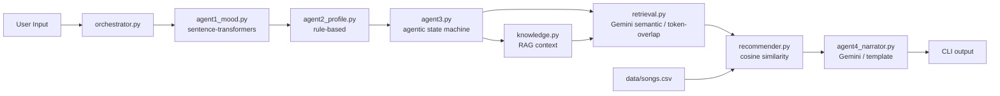

# Implementation Guide

## 1. Purpose And Scope

This guide documents the current codebase for the terminal-first multi-agent DJ music recommender. It is intended to let another engineer implement, modify, or extend the project without guessing contracts.

Scope covered:
- CLI execution flow
- 4-agent pipeline architecture
- Agentic workflow (Agent 3 state machine)
- RAG / Knowledge Base retrieval
- Recommendation scoring (cosine similarity)
- All agent input/output contracts
- Orchestrator wiring
- Evaluation harness
- Test strategy

Out of scope: UI/web frontend

---

## 2. System Context

```
src/
  cli.py              — interactive entry point (default)
  main.py             — demo runner (batch, non-interactive)
  orchestrator.py     — pipeline wiring + progress logging
  recommender.py      — cosine similarity scoring, greedy ranked selection
  retrieval.py        — Gemini semantic retrieval + token-overlap fallback
  knowledge.py        — KB loader and context formatter for RAG
  models.py           — Song and UserProfile dataclasses
  agents/
    agent1_mood.py    — mood detection (sentence-transformers / Gemini / local)
    agent2_profile.py — listener profile builder (rule-based)
    agent3.py         — agentic setlist curator (state machine + simple mode)
    agent4_narrator.py — DJ narration (Gemini paragraph / template fallback)
data/
  songs.csv           — 40-song catalog with audio features
  knowledge_base.json — 18 KB documents (9 genres + 9 moods) for RAG grounding
tests/
  test_recommender.py
  test_retrieval.py
  test_agent1_mood.py
  test_agent2_profile.py
  test_agent3_setlist.py
  test_agent4_narrator.py
  test_orchestrator.py
  test_pipeline_smoke.py
  test_connectivity_smoke.py
eval_harness.py       — 12-case evaluation script (run from project root)
```

Key dependencies:
- `sentence-transformers` — Agent 1 mood detection (~13ms/call, no API key)
- `langchain-google-genai` — Agent 3 retrieval and Agent 4 narration
- `python-dotenv` — loads `GOOGLE_API_KEY` / `GEMINI_API_KEY` from `.env`
- `numpy` — cosine similarity math in recommender

---

## 3. Architecture Overview



### Agent 3 State Machine (agentic mode)

```
plan -> retrieve -> check_confidence -> rank -> finalize -> done
                         |
                    [confidence < 0.5 and retries remain]
                         |
                       retry (clears avoid_genres, doubles pool) -> retrieve
```

Each state logs a step with `step_name`, `decision`, and `data` dict. All steps are returned in `agentic_steps` and displayed in the CLI.

---

## 4. Data Contracts

### 4.1 Song Dict (songs.csv required fields)

| Field | Type | Notes |
|-------|------|-------|
| id | int | unique |
| title | str | |
| artist | str | |
| genre | str | used for avoid filtering |
| mood | str | one of 9 allowed moods |
| energy | float | [0, 1] |
| tempo_bpm | float | normalized to [60, 200] internally |
| valence | float | [0, 1] |
| danceability | float | [0, 1] |
| acousticness | float | [0, 1] |
| instrumentalness | float | default 0.2 |
| brightness | float | default 0.5 |
| mood_tag | str | default = mood |

### 4.2 Agent 1 Output

Function: `analyze_mood(user_message, optional_context=None, trace_id=None, backend="sentence_transformers")`

Backends: `sentence_transformers` (default), `gemini`, `local`, `auto`

| Field | Type | Notes |
|-------|------|-------|
| schema_version | str | "1.0" |
| trace_id | str | UUID |
| detected_mood | str | one of 9 moods or "balanced" |
| confidence | float | cosine sim (ST) or model conf (Gemini) |
| energy_hint | float \| None | per-mood default or Gemini-assigned |
| mood_candidates | list[str] | top 3 |
| notes | str | e.g. `"sentence-transformer:all-MiniLM-L6-v2 score=0.675"` |
| llm_profile | bool | True only when Gemini ran successfully |

Fallback: if confidence < 0.38 (ST) or 0.55 (Gemini/local), `detected_mood` = `"balanced"`.

### 4.3 Agent 2 Output

Function: `parse_profile(user_message, agent1_payload, optional_context=None, trace_id=None)`

Always rule-based. No API calls.

| Field | Type |
|-------|------|
| profile.favorite_genre | str |
| profile.favorite_mood | str |
| profile.target_energy | float [0–1] |
| profile.likes_acoustic | bool |
| profile.avoid_genres | list[str] |
| constraints.parser_mode | str |
| request_summary | str |

Negation phrases (`"no edm"`, `"avoid rap"`) → `avoid_genres`.

### 4.4 Agent 3 Output

Function: `curate_setlist(agent2_payload, songs, k=5, candidate_pool_size=20, trace_id=None, user_message=None, api_key=None, kb_docs=None, agentic=True)`

| Field | Type | Notes |
|-------|------|-------|
| setlist | list[dict] | rank, title, artist, score |
| explanations | list[str] | per-song reason strings |
| profile_echo | dict | copy of agent2 profile |
| retrieval | dict | debug metadata (see below) |
| agentic_steps | list[dict] | only when agentic=True |
| retry_triggered | bool | only when agentic=True |

Retrieval debug fields:

| Field | Description |
|-------|-------------|
| retriever | `"gemini-semantic"` or `"token-overlap"` |
| candidates_after | pool size passed to ranker |
| retrieval_confidence | 0–1 score |
| kb_docs_injected | number of KB docs added to Gemini prompt |
| filtered_avoid_genres | songs excluded by avoid list |

### 4.5 Agent 4 Output

Function: `narrate_setlist(agent3_payload, persona=None, trace_id=None, backend="gemini", api_key=None)`

| Field | Type |
|-------|------|
| paragraph | str | Gemini-generated or template |
| intro | str | legacy field |
| track_transitions | list[str] | legacy field |
| closing | str | legacy field |
| safety_notes | list[str] | |

---

## 5. Retrieval Pipeline

`retrieve_candidates(agent2_payload, songs, top_n, user_message=None, api_key=None, kb_docs=None)`

**Gemini path** (when `api_key` is set):
1. Pre-filter by token overlap — keep top 20 most relevant songs (reduces prompt by ~50%)
2. Load KB context: `retrieve_kb_context(docs, genre, mood)` → `format_kb_context(docs)` → injected string
3. Send filtered catalog + KB context + user message to Gemini
4. Parse `{"ids": [...], "confidence": 0.85}` response
5. Return ordered songs + confidence

**Token-overlap fallback** (no API key):
- Score each song by token overlap with profile query text
- Genre/mood/tag boosts applied
- Confidence = top_score / max_possible (normalized proxy)

---

## 6. Recommender Scoring

`recommend_songs(user_prefs, songs, k)` → `list[tuple[song, score, reasons]]`

**Feature vector** (7 dimensions, all normalized to [0, 1]):
```
[energy, valence, danceability, tempo_norm, acousticness, instrumentalness, brightness]
```

**Score breakdown:**
- Audio cosine similarity × 7.0
- Mood match: up to +2.0 (via `_mood_similarity`)
- Genre exact match: +1.0
- Mood tag match: +0.5

**Greedy diversity penalties** per pick:
- Repeated artist: −2.0
- Repeated genre: −1.0

---

## 7. Knowledge Base

`data/knowledge_base.json` — 18 documents:
- 9 genre docs (pop, lofi, rock, ambient, synthwave, indie pop, jazz, edm, acoustic)
- 9 mood docs (happy, chill, relaxed, moody, sad, intense, focused, nostalgic, balanced)

Each doc: `{id, type, name, description}` with audio feature ranges.

`knowledge.py` API:
```python
docs = load_knowledge_base("data/knowledge_base.json")
relevant = retrieve_kb_context(docs, genre="synthwave", mood="moody", max_docs=4)
context_str = format_kb_context(relevant)  # injected into Gemini prompt
```

---

## 8. Orchestrator

`run_pipeline(user_message, songs, k=5, agent1_backend="sentence_transformers", agent4_backend="gemini", use_agentic=True, kb_docs=None, verbose=False)`

- `verbose=True` prints per-agent progress lines to stdout
- API key resolved from `GOOGLE_API_KEY` or `GEMINI_API_KEY` env vars
- Warns if no key found (Gemini features degrade to local fallback)
- Exposes `agentic_steps` at top level of result when `use_agentic=True`

---

## 9. Evaluation Harness

```bash
python eval_harness.py           # standard mode (agentic=False)
python eval_harness.py --agentic # agentic mode (agentic=True)
```

12 test cases covering all 9 moods. All use local backend (no API key needed).

Metrics per case:
- `mood_match` — detected mood matches expected
- `genre_match` — profile genre matches expected (None = always pass)
- `retrieval_confidence` — raw confidence score
- `no_avoid_violations` — setlist contains no avoided genres

Expected baseline: 12/12 pass, 100% mood/genre accuracy, avg confidence ~0.31 (token-overlap).

---

## 10. Control Flow (Sequence)

```mermaid
sequenceDiagram
  participant User
  participant CLI
  participant Orch as orchestrator.py
  participant A1 as agent1 (sentence-transformers)
  participant A2 as agent2 (rules)
  participant A3 as agent3 (state machine)
  participant Ret as retrieval.py
  participant KB as knowledge.py
  participant Rank as recommender.py
  participant A4 as agent4 (Gemini)

  User->>CLI: vibe text
  CLI->>Orch: run_pipeline(message, songs, k, verbose=True)
  Orch->>A1: analyze_mood(message, backend="sentence_transformers")
  A1-->>Orch: mood payload (~13ms)
  Orch->>A2: parse_profile(message, agent1_payload)
  A2-->>Orch: profile + constraints
  Orch->>A3: curate_setlist(agent2_payload, songs, agentic=True)
  A3->>KB: retrieve_kb_context(genre, mood)
  KB-->>A3: relevant docs
  A3->>Ret: retrieve_candidates(payload, songs, kb_docs)
  Ret-->>A3: candidates + confidence
  Note over A3: check confidence; retry if < 0.5
  A3->>Rank: recommend_songs(user_prefs, candidates, k)
  Rank-->>A3: ranked list with scores
  A3-->>Orch: setlist + agentic_steps
  Orch->>A4: narrate_setlist(agent3_payload, backend="gemini")
  A4-->>Orch: paragraph
  Orch-->>CLI: full result dict
  CLI-->>User: progress log + reasoning steps + setlist table + narration
```

---

## 11. Error Handling

| Scenario | Behavior |
|----------|----------|
| No API key | Agent 3 uses token-overlap; Agent 4 uses template paragraph; warning printed |
| Gemini call fails | Agent 3 falls back to token-overlap; Agent 4 falls back to template |
| Low ST confidence (< 0.38) | Agent 1 returns `"balanced"` mood |
| Invalid agent2 profile | Agent 3 returns `error: "invalid_profile_payload"`, empty setlist |
| Empty setlist | Agent 4 returns canned fallback paragraph |
| LangChain content as list | All Gemini callers use `_lc_text(response)` helper to extract text |

---

## 12. Public Interfaces

```python
# Agent 1
analyze_mood(user_message, optional_context=None, trace_id=None,
             backend="sentence_transformers", model="gemini-3-flash-preview",
             api_key=None) -> dict

# Agent 2
parse_profile(user_message, agent1_payload, optional_context=None,
              trace_id=None) -> dict

# Agent 3
curate_setlist(agent2_payload, songs, k=5, candidate_pool_size=20,
               trace_id=None, user_message=None, api_key=None,
               kb_docs=None, agentic=True) -> dict

# Agent 4
narrate_setlist(agent3_payload, persona=None, trace_id=None,
                backend="gemini", api_key=None) -> dict

# Orchestrator
run_pipeline(user_message, songs, k=5, agent1_backend="sentence_transformers",
             agent4_backend="gemini", use_agentic=True, kb_docs=None,
             verbose=False) -> dict

# Recommender
load_songs(csv_path) -> list[dict]
recommend_songs(user_prefs, songs, k=5) -> list[tuple[dict, float, list[str]]]

# Retrieval
retrieve_candidates(agent2_payload, songs, top_n, user_message=None,
                    api_key=None, kb_docs=None) -> tuple[list[dict], dict]

# Knowledge base
load_knowledge_base(kb_path) -> list[dict]
retrieve_kb_context(docs, genre=None, mood=None, max_docs=4) -> list[dict]
format_kb_context(docs) -> str
```

---

## 13. Testing

Run all tests:
```bash
python -m pytest -q .
```

Focused suites:
```bash
python -m pytest -q tests/test_retrieval.py
python -m pytest -q tests/test_agent3_setlist.py
python -m pytest -q tests/test_orchestrator.py
```

Smoke tests (requires API key):
```bash
python -m pytest -q -m smoke
```

---

## 14. Build Order For New Features

1. Update the data contract in this guide first
2. Implement in the relevant `src/agents/` or `src/` file
3. Wire through orchestrator if pipeline shape changes
4. Add tests in `tests/`
5. Run full test suite
6. Update README and this guide

Definition of done: tests pass, CLI runs end-to-end, contracts documented.
