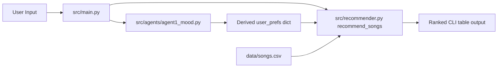
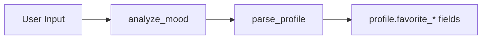
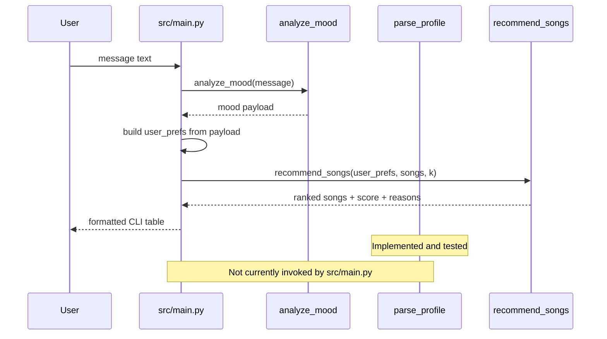

# Implementation Guide

## 1. Purpose And Scope

This guide documents the current codebase behavior for the terminal-first music recommender and agent parsing modules. It is intended to let another engineer or coding agent implement, modify, or extend the project in one pass without guessing contracts.

Scope covered:
- CLI execution flow
- Recommendation scoring and ranking
- Agent 1 mood analysis contract
- Agent 2 profile parsing contract
- Data model and CSV schema assumptions
- Test strategy and acceptance checks

Out of scope:
- UI/web frontend
- Agent 3 and Agent 4 orchestration

## 2. System Context

The repository is a Python package with a deterministic ranking core and a lightweight agent module:
- Recommender core: src/recommender.py
- Models: src/models.py
- Agent 1: src/agents/agent1_mood.py
- Agent 2: src/agents/agent2_profile.py
- CLI entry: src/main.py
- Test suites: tests/test_recommender.py, tests/test_agent1_mood.py, tests/test_agent2_profile.py

The system reads a local CSV dataset and does not require network calls for normal ranking or profile parsing. Optional smoke testing uses Gemini when configured.

## 3. Architecture Overview



Current state:
- src/main.py wires Agent 1 directly to recommender user_prefs.
- Agent 2 exists as an implementation-ready module and is validated by tests, but is not yet called by src/main.py.

Available module flow (not yet wired in CLI):



Secondary utility path:
- tests/test_connectivity_smoke.py performs optional Gemini connectivity smoke checks.

## 4. Data Contracts And Schemas

### 4.1 Song Dict Contract For Functional Recommender

Required keys consumed by recommend_songs:
- id: int
- title: str
- artist: str
- genre: str
- mood: str
- energy: float
- tempo_bpm: float
- valence: float
- danceability: float
- acousticness: float

Optional keys with defaults in load_songs:
- popularity: int (default 50)
- release_decade: int (default 2010)
- mood_tag: str (default mood or balanced)
- instrumentalness: float (default 0.2)
- vocal_presence: float (default 0.8)
- brightness: float (default 0.5)

### 4.2 User Preference Dict Contract

Keys used by functional scoring:
- genre: str
- mood: str
- energy: float
- likes_acoustic: bool

Invariants:
- Missing numeric fields are coerced with safe defaults.
- Non-numeric numeric fields fall back to default values.

### 4.3 Agent 1 Output Contract

Function: analyze_mood(user_message, optional_context=None, trace_id=None)

Output payload:
- schema_version: str
- trace_id: str
- detected_mood: str
- confidence: float in [0.0, 1.0]
- energy_hint: float in [0.0, 1.0] or null
- mood_candidates: list[str]
- notes: str

Validation and fallback:
- detected_mood must be an allowed mood label.
- If confidence < 0.55, detected_mood must be balanced.
- If no keywords match, mood_candidates becomes [balanced].

Example payload:

```json
{
  "schema_version": "1.0",
  "trace_id": "3b8f5f27-1b84-4dbf-8e7a-7f018cbd5f6f",
  "detected_mood": "happy",
  "confidence": 0.63,
  "energy_hint": 0.85,
  "mood_candidates": ["happy", "intense", "chill"],
  "notes": "keyword-based mood match: happy"
}
```

### 4.4 Agent 2 Input And Output Contract

Function: parse_profile(user_message, agent1_payload, optional_context=None, trace_id=None)

Agent 2 input fields:
- user_message: str
- agent1_payload: dict
  - detected_mood: str
  - confidence: float-like value
  - energy_hint: float-like value or null
  - trace_id: str optional
- optional_context: dict or null
  - favorite_genre: str optional
- trace_id: str optional

Output payload:
- schema_version: str
- trace_id: str
- profile: dict
  - favorite_genre: str
  - favorite_mood: str
  - target_energy: float in [0.0, 1.0]
  - likes_acoustic: bool
  - avoid_genres: list[str]
- constraints: dict
  - missing_fields: list[str]
  - inferred_fields: list[str]
  - low_confidence_mood: bool
  - disallowed_or_unknown_terms: list
  - parser_mode: str (rules)
- request_summary: str

Validation and fallback:
- Invalid or unknown detected_mood is treated as balanced.
- If explicit mood is not present and Agent 1 confidence < 0.55, favorite_mood becomes balanced.
- Explicit numeric energy and energy keywords from user_message override energy_hint.
- If genre is not extractable from message, parser uses optional_context.favorite_genre if valid; otherwise default pop.
- All energy outputs are clamped to [0.0, 1.0].

Example payload:

```json
{
  "schema_version": "1.0",
  "trace_id": "trace-abc",
  "profile": {
    "favorite_genre": "hip-hop",
    "favorite_mood": "chill",
    "target_energy": 0.35,
    "likes_acoustic": true,
    "avoid_genres": ["edm"]
  },
  "constraints": {
    "missing_fields": [],
    "inferred_fields": ["likes_acoustic"],
    "low_confidence_mood": false,
    "disallowed_or_unknown_terms": [],
    "parser_mode": "rules"
  },
  "request_summary": "Prefers hip-hop with a chill vibe around energy 0.35."
}
```

## 5. Control Flow And Decision Points



Decision points:
- Agent confidence gate:
  - confidence >= 0.55 uses top detected mood
  - confidence < 0.55 forces balanced fallback
- Energy hint precedence:
  - high-energy keywords override low-energy keywords
  - low-energy keywords used when no high-energy keyword is present
  - fallback to mood-based energy hint only when confidence is high enough
- Agent 2 profile precedence:
  - explicit mood in user message overrides Agent 1 mood
  - explicit energy in user message overrides Agent 1 energy_hint
  - optional_context genre is used only when user message has no valid genre

## 6. Error Handling And Fallback Behavior

Current state:
- Recommender parsing uses safe converters (_safe_float and _safe_int), avoiding crashes on malformed CSV values.
- Agent 1 handles empty input and ambiguous text by returning balanced fallback.
- Agent 2 handles invalid confidence, missing trace ids, unknown genre text, and invalid Agent 1 mood labels through rule-based fallback.
- Connectivity helper returns structured error payload instead of raising when API key/dependencies/network are missing.

Known fallback outcomes:
- missing GOOGLE_API_KEY -> {"ok": false, "error": "missing GOOGLE_API_KEY"}
- ambiguous mood text -> detected_mood = balanced
- missing genre signal in Agent 2 -> profile.favorite_genre = pop
- invalid energy hint in Agent 2 -> profile.target_energy = 0.55 (or explicit message energy if present)

## 7. Setup And Run Commands

```bash
python -m venv .venv
```

```bash
# Windows
.venv\Scripts\activate

# macOS/Linux
source .venv/bin/activate
```

```bash
pip install -r requirements.txt
```

Run CLI:

```bash
python -m src.main
```

Alternative:

```bash
python src/main.py
```

Optional script entrypoint (after editable install):

```bash
pip install -e .
dj-recommender
```

Run smoke tests only:

```bash
python -m pytest -q -m smoke
```

Smoke test behavior:
- If GOOGLE_API_KEY is missing, the smoke test is skipped.

## 8. Testing Strategy And Verification Commands

Current automated tests:
- tests/test_recommender.py
  - ranking order sanity
  - explanation string is non-empty
  - diversity penalty behavior
- tests/test_agent1_mood.py
  - payload schema validation
  - fallback confidence behavior
  - trace ID propagation
  - edge cases for empty input and energy-hint precedence
- tests/test_agent2_profile.py
  - profile schema validation
  - defaulting and fallback behavior for missing signals
  - explicit mood/energy precedence over Agent 1 hints
  - genre normalization and avoid_genres extraction
  - trace ID precedence and generation behavior
  - optional context genre handling

Run all tests:

```bash
python -m pytest -q .
```

Run focused suites:

```bash
python -m pytest -q tests/test_recommender.py
python -m pytest -q tests/test_agent1_mood.py
python -m pytest -q tests/test_agent2_profile.py
```

## 9. Acceptance Criteria

A change is done when all are true:
- CLI runs without import errors from project root.
- src/main.py prints ranked recommendation tables.
- Agent 1 output always includes all required fields.
- Agent 2 output always includes schema_version, trace_id, profile, constraints, and request_summary.
- Agent 1 confidence fallback behavior remains intact at threshold 0.55.
- Agent 2 precedence and fallback behavior remains intact at threshold 0.55 for mood confidence handoff.
- Full test suite passes.

## 10. Known Limitations And Open Questions

Known limitations:
- Catalog is small and static.
- Mood parser is keyword-based and English-centric.
- src/main.py does not yet invoke Agent 2 even though Agent 2 is implemented and tested.
- Agent 2 parser is rule-based and depends on explicit token patterns.
- Full orchestration across Agent 3 and Agent 4 is planned but not implemented.

Open questions:
- Should Agent 2 replace _prefs_from_agent_message in src/main.py as the default bridge?
- Should Gemini connectivity smoke checks remain test-only or integrate into CLI startup?

## One-Shot Build Readiness Checklist

File-level implementation map:
- Edit src/agents/agent1_mood.py for mood behavior changes.
- Edit src/agents/agent2_profile.py for profile parsing changes.
- Edit src/recommender.py for scoring/weight changes.
- Edit src/main.py for CLI flow changes.
- Update tests/test_agent1_mood.py, tests/test_agent2_profile.py, and tests/test_recommender.py for regression coverage.

Public interfaces and signatures:
- src/agents/agent1_mood.py
  - analyze_mood(user_message: str, optional_context: dict | None = None, trace_id: str | None = None) -> dict
  - class MoodAnalyst.analyze(...same args...) -> dict
- src/agents/agent2_profile.py
  - parse_profile(user_message: str, agent1_payload: dict, optional_context: dict | None = None, trace_id: str | None = None) -> dict
  - class ProfileParser.parse(...same args...) -> dict
- src/recommender.py
  - load_songs(csv_path: str) -> list[dict]
  - recommend_songs(user_prefs: dict, songs: list[dict], k: int = 5) -> list[tuple[dict, float, list[str]]]
  - class Recommender.recommend(user: UserProfile, k: int = 5) -> list[Song]

Dependencies and environment assumptions:
- Python >= 3.11
- pandas
- pytest
- Optional for connectivity utility: langchain-google-genai, langchain-core, and python-dotenv

Step-by-step build order for a new feature:
1. Update data contracts in code and docs.
2. Implement Agent behavior changes in src/agents as needed.
3. Implement recommender or CLI integration changes.
4. Add focused tests for new behavior.
5. Run targeted tests, then full suite.
6. Update README and this guide if interfaces changed.

Definition of done:
- Tests pass and cover new behavior.
- CLI output remains functional.
- Contracts and examples are updated.
- No unresolved TODOs in changed paths.

## Change Summary

- Updated guide to match current repository state, including Agent 2 profile parser contract and tests.
- Clarified current CLI wiring versus available but not-yet-integrated Agent 2 flow.
- Expanded testing and acceptance criteria to include Agent 2 behavior and smoke-test constraints.
