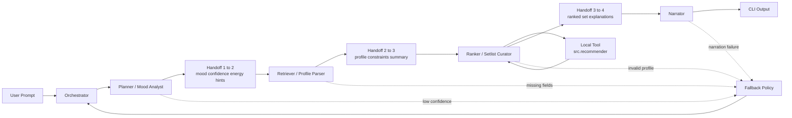

# Multi-Agent DJ Recommender Plan

## Purpose
This plan defines execution scope for a demo-first technical prototype that showcases multi-agent AI architecture for music recommendation.

## Product Framing
- This is an internal technical showcase, not a consumer product launch.
- Primary audience: leadership stakeholders evaluating architecture quality.
- Demo objective: show visible agentic reasoning from user vibe to ranked playlist.

## Current Status
- Day 1 setup and refactor are complete.
- Agent 1 (Mood Analyst) is implemented with schema validation and fallback behavior. Supports local, gemini, and auto backends.
- Agent 2 (Profile Parser) is implemented with structured profile + constraints output.
- Agent 3 (Setlist Curator) is implemented. Runs a RAG-lite retrieval stage (src/retrieval.py) before deterministic scoring, returns ranked setlist with retrieval debug metadata.
- Agent 4 (Narrator) is implemented. Produces intro, track_transitions, and closing. Supports persona styles.
- Orchestrator (src/orchestrator.py) wires all four agents with shared trace_id.
- Interactive CLI (src/cli.py) and demo runner (src/main.py) both call the orchestrator.
- Deterministic ranking in `src/recommender.py` is active and tested.
- All test suites (Agents 1-4, orchestrator, pipeline smoke) are present.

## Core Value Proposition
The project demonstrates:
1. Intent parsing that handles messy natural language vibes.
2. Grounded retrieval/ranking over known local catalog data.
3. Legible, step-by-step agent outputs in CLI for demo transparency.

## Architecture Overview

## In Scope (v1)
- Local CLI interface only.
- Hand-labeled CSV catalog as data source.
- 10-20 common vibe intents handled well (focus, gym, chill, sad, party, study, etc.).
- Four-agent pipeline with visible reasoning outputs.
- Strict JSON handoffs and traceability (`schema_version`, `trace_id`).

## Out Of Scope (v1)
- Playback integrations (Spotify/Apple Music).
- GUI/web/mobile app.
- Auth, accounts, multi-tenant support.
- Large-scale real-time catalog ingestion.
- Production deployment and cost/latency optimization.

## Success Criteria
At demo time, success means:
1. Stakeholder enters free-form vibe and gets sensible ranked results within ~10-20 seconds.
2. CLI trace clearly shows each agent contribution.
3. Team can explain why multi-agent orchestration is better than a single-call baseline for this task.
4. Leadership feedback focuses on architecture quality, not missing product features.

## 7-Day Execution Plan

### Day 1 - Refactor + Setup
- Completed:
  - Split models into `src/models.py`
  - Preserved ranking logic in `src/recommender.py`
  - Consolidated diversity penalties
  - Verified CLI run paths

### Day 2 - Agent 1 (Planner / Mood Analyst)
- Goal: Parse raw user vibe into normalized mood signal.
- Deliverables:
  - `detected_mood`, `confidence`, `energy_hint`, `mood_candidates`, `notes`
  - Fallback behavior for ambiguous input
- Tests:
  - Schema validation
  - Ambiguous input fallback
  - Backend fallback behavior
- Status: Completed

### Day 3 - Agent 2 (Retriever Prep / Profile Parser)
- Goal: Convert intent + Agent 1 output into recommender-ready profile.
- Deliverables:
  - `profile` with genre, mood, energy, acoustic preference, avoid_genres
  - `constraints` and `request_summary`
- Tests:
  - Schema + required fields
  - Defaults/fallbacks
  - Confidence-threshold behavior
- Status: Completed

### Day 4 - Agent 3 (Ranker / Setlist Curator)
- Goal: Wrap deterministic scoring as tool-style agent output.
- Input:
  - Agent 2 profile payload
  - Catalog path
- Output:
  - Ranked setlist with scores and explanations
- Tests:
  - Golden ranking test
  - Tool contract test
  - Regression stability test
- Status: Completed
  - src/agents/agent3_setlist.py implemented with curate_setlist and SetlistCurator
  - src/retrieval.py implements RAG-lite retrieval stage with avoid_genres filtering
  - retrieval debug metadata returned in every payload
  - tests/test_agent3_setlist.py present

### Day 5 - Agent 4 (Narrator)
- Goal: Produce compact DJ narration over ranked setlist.
- Output:
  - `intro`, `track_transitions`, `closing`
- Tests:
  - Schema checks
  - Non-empty narrative assertions
  - Optional smoke test for LLM-backed generation
- Status: Completed
  - src/agents/agent4_narrator.py implemented with narrate_setlist and DJNarrator
  - Supports persona dict with style (friendly or concise)
  - Empty setlist fallback included
  - tests/test_agent4_narrator.py present

### Day 6 - Orchestration + Demo Loop
- Goal: Run all four agents in a single traceable CLI flow.
- Flow:
  - Planner -> Retriever/Profile Parser -> Ranker -> Narrator
- Tests:
  - End-to-end integration
  - Retry/escalation behavior
- Stretch:
  - Add lightweight state machine / LangGraph orchestration
- Status: Completed
  - src/orchestrator.py implements run_pipeline with configurable backend and persona
  - src/cli.py interactive CLI with k, backend, and output mode prompts
  - src/main.py demo runner for two canned prompts
  - tests/test_orchestrator.py and tests/test_pipeline_smoke.py present

### Day 7 - Demo Polish + Delivery
- Goal: Demo readiness for leadership audience.
- Tasks:
  - Improve CLI readability and pacing
  - Finalize README and architecture docs
  - Run final test suite
  - Capture limitations + next-step roadmap

## JSON Handoff Contracts

### Agent 1 -> Agent 2
- `schema_version: str`
- `trace_id: str`
- `detected_mood: str`
- `confidence: float`
- `energy_hint: float | null`
- `mood_candidates: list[str]`
- `notes: str`

### Agent 2 -> Agent 3
- `schema_version: str`
- `trace_id: str`
- `profile: dict`
- `constraints: dict`
- `request_summary: str`

### Agent 3 -> Agent 4
- `schema_version: str`
- `trace_id: str`
- `setlist: list[dict]`
- `explanations: list[str]`
- `profile_echo: dict`

## Shared Agent Rules
- Return valid JSON only.
- Include `schema_version` and `trace_id` in every payload.
- Apply fallback payloads rather than crash on low confidence or invalid input.
- Keep outputs bounded and testable.

## Open Decisions
1. Is this prototype expected to become a productized project after the demo?
2. Who owns CSV labeling quality and validation standard?
3. What is the live-demo fallback if orchestration fails?
4. Should we frame this externally as "multi-agent" or "orchestrated LLM pipeline"?

## Risk Watchlist
- Label quality bottleneck in CSV reduces recommendation quality regardless of architecture.
- JSON contract drift can break downstream agents late in the cycle.
- Over-expanding profile schema too early can create avoidable churn.
- Demo reliability risk if external model calls are not bounded with robust fallbacks.

## Nice-To-Have (Post-v1)
- Persistent local user preference memory.
- Compact/verbose CLI modes.
- Snapshot tests for CLI traces.
- Weighted preference vectors with backward compatibility.
