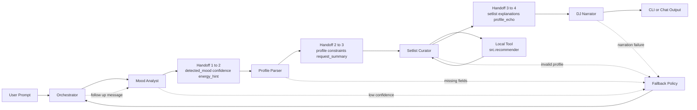

# Multi-Agent DJ Recommender Plan

## Purpose
This file tracks implementation ideas and execution scope for the 7-day roadmap.

## Current Status
- Day 1 refactor is complete: models split, import cleanup, shared diversity logic, CLI table cleanup.
- Agent 1 mood analysis is complete: schema, fallback behavior, notes field, and smoke coverage are in place.
- Existing recommender tests pass.

## Guiding Principles
- Keep each day focused on one major deliverable.
- Add tests for every completed agent before moving on.
- Keep JSON handoffs stable and versioned early.
- Prefer small, reversible changes over big rewrites.

## Pipeline Diagram

## 7-Day Execution Plan

### Day 1 - Refactor + Setup
- Completed:
  - Split `Song` and `UserProfile` into `src/models.py`
  - Keep recommendation logic in `src/recommender.py`
  - Consolidate diversity penalties into one helper
  - Ensure CLI runs from multiple entry points
  - Confirm LangChain + Gemini minimal connectivity check

### Day 2 - Agent 1 (Mood Analyst)
- Goal: Convert raw user text into normalized mood signal.
- Output schema idea:
  - `detected_mood` (string)
  - `confidence` (float 0-1)
  - `energy_hint` (float 0-1, optional)
  - `notes` (short string)
- Tests:
  - Valid schema
  - Handles unknown/ambiguous mood text
  - Real API smoke test
- Status:
  - Completed

### Day 3 - Agent 2 (Profile Parser)
- Goal: Convert user intent and Mood Analyst output into recommender-ready preferences.
- Output schema idea:
  - `favorite_genre` or `genre_weights`
  - `favorite_mood`
  - `target_energy`
  - `likes_acoustic`
  - `avoid_genres` (optional)
- Tests:
  - Schema validation
  - Fallback defaults for missing fields
  - Real API call test

### Day 4 - Agent 3 (Setlist Curator Tool)
- Goal: Wrap existing Python scoring logic as a LangChain Tool (no LLM call inside tool).
- Input:
  - Parsed profile JSON
  - Song catalog path
- Output:
  - Ranked track list with scores and reasons
- Tests:
  - Deterministic golden set test
  - Tool contract test
  - Regression test for ranking stability

### Day 5 - Agent 4 (DJ Narrator)
- Goal: Turn curated setlist into personality-driven DJ narration.
- Output schema idea:
  - `intro`
  - `track_transitions` (list)
  - `closing`
- Tests:
  - Schema validation
  - Tone/style assertions (lightweight)
  - Real API smoke test

### Day 6 - Pipeline + Chat Loop
- Goal: Orchestrate all 4 agents and support follow-up prompts.
- Flow:
  - Mood Analyst -> Profile Parser -> Setlist Curator -> DJ Narrator
- Tests:
  - End-to-end pipeline integration test
  - Follow-up message rerun behavior
- Stretch:
  - Introduce LangGraph for feedback loop and state handling

### Day 7 - Polish + Delivery
- Goal: Production-like demo readiness.
- Tasks:
  - Upgrade CLI output with `rich`
  - Update README with architecture and run instructions
  - Final full test run
  - Capture known limitations and future improvements

## JSON Handoff Drafts (First Pass)
- Keep schemas strict enough for tests, but small enough to evolve quickly.

### Agent 1 -> Agent 2
- `detected_mood: str`
- `confidence: float`
- `energy_hint: float | null`

### Agent 2 -> Agent 3
- `profile: dict`
- `constraints: dict`
- `request_summary: str`

### Agent 3 -> Agent 4
- `setlist: list[dict]`
- `explanations: list[str]`
- `profile_echo: dict`

## Agent Contract Sheet (v0.1)

### Shared Contract Rules
- Every agent returns valid JSON only (no markdown, no prose wrappers).
- Include `schema_version` in every payload.
- Include `trace_id` so one user request can be traced across all agents.
- If confidence is low or required fields are missing, agent returns a fallback payload instead of crashing.

### Agent 1: Mood Analyst
- Responsibility:
  - Infer emotional intent from user message.
  - Normalize mood label to allowed values.
- Input:
  - `user_message: str`
  - `optional_context: dict`
- Output:
  - `schema_version: str`
  - `trace_id: str`
  - `detected_mood: str`
  - `confidence: float`
  - `energy_hint: float | null`
  - `mood_candidates: list[str]`
- Validation:
  - `confidence` must be in [0.0, 1.0]
  - `detected_mood` must be one of allowed labels
- Fallback policy:
  - If confidence < 0.55, set `detected_mood = "balanced"` and keep top candidates.

### Agent 2: Profile Parser
- Responsibility:
  - Convert user intent + mood signal into structured preferences for ranking.
- Input:
  - Agent 1 payload
  - Raw user preference text
- Output:
  - `schema_version: str`
  - `trace_id: str`
  - `profile: dict`
    - `favorite_genre: str`
    - `favorite_mood: str`
    - `target_energy: float`
    - `likes_acoustic: bool`
    - `avoid_genres: list[str]`
  - `constraints: dict`
  - `request_summary: str`
- Validation:
  - Required keys in `profile` must exist
  - `target_energy` clamped to [0.0, 1.0]
- Fallback policy:
  - Missing preferences get safe defaults and are flagged in `constraints.missing_fields`.

### Agent 3: Setlist Curator (Tool-Driven)
- Responsibility:
  - Build ranked setlist using local recommender tool (no LLM call in scoring tool).
- Input:
  - Agent 2 payload
  - Song catalog
- Output:
  - `schema_version: str`
  - `trace_id: str`
  - `setlist: list[dict]`
    - `rank: int`
    - `title: str`
    - `artist: str`
    - `score: float`
  - `explanations: list[str]`
  - `profile_echo: dict`
- Validation:
  - `setlist` length must match requested k
  - `rank` order must be ascending from 1..k
- Fallback policy:
  - If profile invalid, return empty setlist plus actionable error field.

### Agent 4: DJ Narrator
- Responsibility:
  - Turn curated setlist into DJ-style narrative text for CLI/chat output.
- Input:
  - Agent 3 payload
  - Optional persona config
- Output:
  - `schema_version: str`
  - `trace_id: str`
  - `intro: str`
  - `track_transitions: list[str]`
  - `closing: str`
  - `safety_notes: list[str]`
- Validation:
  - `track_transitions` count must align with setlist size
  - No empty intro/closing
- Fallback policy:
  - If narration generation fails, output minimal neutral narration template.

### Orchestrator Rules (Day 6)
- Flow:
  - Agent 1 -> Agent 2 -> Agent 3 -> Agent 4
- Retry policy:
  - One retry max for Agent 1/2/4 on schema failure
  - No retry for Agent 3 tool errors without input fix
- Escalation:
  - If two consecutive schema failures occur, return a user-facing clarification request.

## Risk Watchlist
- Mood synonym mismatch (example: upbeat vs happy) can change ranking significantly.
- JSON shape drift across agents can break pipeline integration late.
- Overexpanding `UserProfile` too early can cause churn in tests and parser logic.

## Nice-to-Have Ideas
- Add weighted preferences (`genre_weights`, `mood_weights`) with backward compatibility.
- Add output modes for CLI: `compact` and `verbose`.
- Add snapshot tests for key CLI tables.
